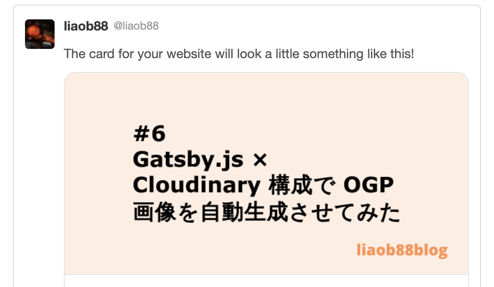

## 結論

こんな感じで記事に合わせた OGP 画像が表示されるようになった



## やったこと

まとめると以下の通り。

- [createPages API](https://www.gatsbyjs.com/docs/reference/config-files/gatsby-node/#createPages) の中で各記事用の OGP 画像 URL を生成
- その URL を pageContext として `Post.tsx` (本ブログ内で各記事の template として使用されている Component)に渡す
- あとは `Post.tsx` 側で使用している SEO コンポーネントにその URL を渡し OGP 設定に追加

createPages API を選んだのは、各記事のタイトル情報と記事の index 情報を OGP 画像のタイトルに使用したく、そのために各記事の Node にアクセスする必要があったから。

以下は createPages API での OGP 画像 URL 生成箇所。

- `gatsby-node/index.ts`

  ```ts
  export const createPages: GatsbyNode["createPages"] = async ({
    graphql,
    actions: { createPage },
  }) => {
    //...省略

    // posts = build 対象記事の node を要素とする配列
    posts.forEach(({ node }, index) => {
      const next = getNextPost(index)
      const previous = getPreviousPost(index)

      // ogp image url の生成
      const titleOnImage = `#${index}\n${node.frontmatter.title}`
      const ogpImageUrl = new CloudinaryService(titleOnImage).getImageUrl()

      createPage({
        path: node.frontmatter.slug,
        component: path.resolve("./src/templates/Post.tsx"),
        context: {
          slug: node.frontmatter.slug,
          title: node.frontmatter.title,
          ogpImageUrl, // pageContext に追加
          previous,
          next,
        },
      })
    })
  ```

- `lib/CloudinaryService.ts`

  ```ts
  import * as cloudinary from "cloudinary"

  export default class CloudinaryService {
    overlayText: string = ""

    constructor(textOnImage: string) {
      cloudinary.v2.config({
        cloud_name: process.env.CLOUDINARY_CLOUD_NAME,
        api_key: process.env.CLOUDINARY_API_KEY,
        api_secret: process.env.CLOUDINARY_API_SECRET,
      })
      this.overlayText = textOnImage
    }

    private createTransformationConfig() {
      return [
        {
          overlay: {
            font_family: "Verdana",
            font_size: 65,
            font_weight: "bold",
            text: this.overlayText,
          },
          width: 800,
          height: 400,
          crop: "fit",
        },
      ]
    }

    getImageUrl(): string {
      return cloudinary.v2.url(process.env.BASE_IMAGE, {
        transformation: this.createTransformationConfig(),
        sign_url: true,
        type: "authenticated",
        secure: true,
      })
    }
  }
  ```

## Cloudinary API について

ドキュメントが充実していますので、詳細はこちらを [Transformation API](https://cloudinary.com/documentation/image_transformations) 見てみてください。

簡単に言えば以下のようになるかと思います。

- ベースイメージを用意(本ブログの場合、Cloudinary クラウドにあらかじめベースイメージを upload しました)
- その画像をどう使う(編集する)かを指定する transformation config を API に渡す。本ブログの場合で言えばこの関数の戻り値。
  - ```ts
    private createTransformationConfig() {
      return [
        {
          overlay: {
            font_family: "Verdana",
            font_size: 65,
            font_weight: "bold",
            text: this.overlayText,
          },
          width: 800,
          height: 400,
          crop: "fit",
        },
      ]
    }
    ```
- config に沿って以下のような syntax で書かれた URL が生成されるので、あとはこれを image タグの src なり、その他使用したい箇所などで使用する。
  - `https://res.cloudinary.com/<cloud_name>/<asset_type>/<delivery_type>/<transformations>/<version>/<public_id>.<extension>`(URL は設定により異なることがあります。)

## 気にかけたこと

- 既存の Gatsby 用プラグインがあるのを知った上で使わなかったこと
  - [gatsby-transformer-cloudinary](https://www.gatsbyjs.com/plugins/gatsby-transformer-cloudinary/)
  - 勉強のため
  - 上記プラグインは画像表示まで考えられているが、今回は画像 URL の取得ができれば十分だった
- 画像 URL の生成タイミングを build の中にしたこと
  - template や SEO コンポーネントでの実施も考えたが、API 実行をそれらの箇所で行うのは、責務の観点でおかしいだろうと考えた
- CloudinaryService
  - url メソッドを使った点
    - image メソッドなどもあったが、「SEO コンポーネントの OGP 設定に画像 url を渡すこと」が目的だったので、その用途に合うメソッドを選んだ
    - https://cloudinary.com/documentation/image_transformations#embedding_images_in_web_pages
  - TS 化
    - [型定義ファイル](https://github.com/cloudinary/cloudinary_npm/blob/7dcdd278da4c57c28f9eb20fe501b618458c05c6/types/index.d.ts)が提供されていたので TS 化することにした。
  - 設計
    - 初期化に引数として画像に載せる文字(記事タイトル)を取るようにしたこと
    - `getImageUrl()`が title 文字列を受け取ったりしてもよかったのが、初期化時にインスタンス変数として扱うようにすることで、呼び出しもとが `getImageUrl()` の引数情報などについて知る必要がなくなり、結果依存を少なくできるのでは？と思った

## 気になっていること

- CloudinaryService 設計の正当性
  - 初期値にタイトルを受け取る部分
  - その他色々
- 長いタイトルだと写真上で文字が省略されてしまう
  - Cloudinary API の引数に渡す transformation 設定の設定ミスだと考えているが原因はわからない。一旦完成を優先したので後日また検証して修正したい

## 感想

Cloudinary すごく便利。

API の使い方だけ少し慣れるまで時間はかかったが、ドキュメントはもちろんのこと、サポートページや Youtube での使用説明動画などもあり、開発体験はすごく良いと感じた。

ひとまず OGP 画像を設定したいという人にとってはとてもおすすめな手段の一つだと思う。
