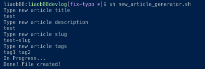
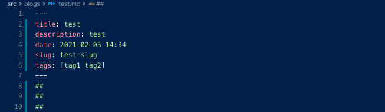

## やりたかったこと
このブログで新規記事を作成する場合、
- 毎回ファイルを作成
- Front matter の記述
 
をする必要がありました。

これが面倒になってきたので、対話型のスクリプトを生成して自動化したいと思いました。
特に Front matter に関していえば他の記事からコピペするというエンジニアらしくないことをしていたので。。。
## やったこと

初心者感満載ですかね。。

h2 タグも毎回書くだろうしと思い適当に追加しています。

```shell
# Article info
echo 'Type new article title'
read TITLE
echo 'Type new article description'
read DESCRIPTION
echo 'Type new article slug'
read SLUG
echo 'Type new article tags'
declare TAGS=()
read TAGS
NOW=`date "+%Y-%m-%d %H:%M"`

# Generate new md file with writing the article info on the file
echo 'In Progress...'
cat <<EOF > "src/blogs/${TITLE}.md"
---
title: $TITLE
description: $DESCRIPTION
date: $NOW
slug: $SLUG
tags: [$TAGS]
---
##
##
##
EOF
echo 'Done! File created!'
```
## できたこと
ターミナル上ではこんな感じで操作します。



生成されたファイルはこんな感じです




とりあえずこれでやりたいことはできた感じです。

## 詰まった点
### コマンドライン変数で渡された複数の変数から成る配列を作る
tag は1記事につき複数個渡される可能性が高いと思い、コマンドライン変数に渡された任意の数の変数から構成される配列が作りたかったです。
しかし、最初に書いたコードは

```shell
echo 'Type new article tags'
read TAGS
declare TAGS_ARRAY=($TAGS)
```
みたいな感じで、配列の初期化と代入を同時に行ってしまっていました。これだとできなかったです。

つまり配列の初期化→代入 の手順をふむ必要がありました。そして前述の通り、

```shell
echo 'Type new article tags'
declare TAGS=()
read TAGS
```

という感じになりました。

### 複数行で構成される文字列をファイルに書き出す
こちらの記事を見ました
>catコマンドは引数を付けずに実行すると標準入力の内容をそのまま標準出力に出力するのだが、これを利用してリダイレクトで任意の内容を(コマンド実行により)ファイルに書き出すことができる。

https://kakurasan.hatenadiary.jp/entry/20091124/p1

cat コマンドでできるのは学びでした。

## 感想
ちょっとした簡単自動化で、詰まった点に関してはどちらもググれば出てくるため、ブログにする必要もなかったかもしれないですが、学びがあったので初心者の備忘録として残しておきたいと思い書きました。
